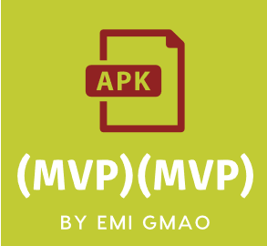
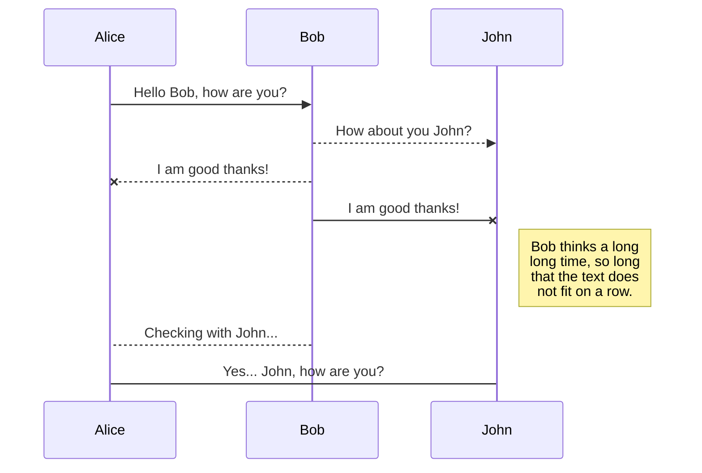
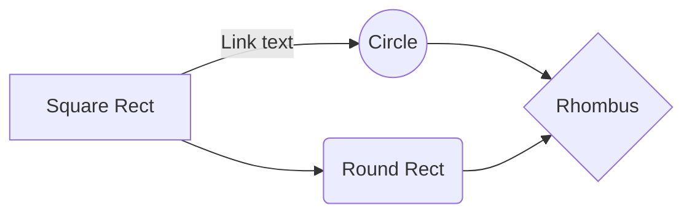




# Illustration  Modèle de Conception Android MVP

Ceci est un projet Android illsutrant :

Pourquoi avons-nous besoin de l’application blanche ? 
Diffuser les bonnes pratiques. 
Capitaliser les connaissances. 
Faciliter l’apprentissage et la montée en compétence des développeurs/concepteurs. 
Homogénéisation de l’implémentation (exemple : Dagger 2 et l’injection de dépendances) 

Pour définir et présenter l’architecture logicielle commune aux applications SPOT Mobiles et ainsi préparer la mise en place de composants technico fonctionnels communs et réutilisables. 
Pour cela elle doit illustrer les sujets suivants : 
A - Conception 
A.2 Modèle de conception 
A.3 Modélisation 
B - Implémentation 
B.1 Schéma Directeur : Une pile logicielle unifiée 
B.2 Initialiser son projet Android SPOT 
B.3 Test unitaires 
B.4 Conventions de nommage 
C - Test 
C.3 Automatisation : Usine logicielle 
D - Intégration Continue 
D.1 Git dans l’usine Logicielle 
D.2 Build Android 
D.3 Configurer son projet pour la PIC 
G - Sécurité 

 Basé sur le modèle  d'architecture logicelle en MVP et utilise Dagger2, RxJava2, Retrofit2, Room.

> Ceci n'est pas un starter kit.

Insérer captures de l'applications de open data sncf


## Getting Started

Ces instructions vous permettront d'obtenir une copie du projet opérationnel sur votre machine locale à des fins d'apprentissage, de développement et de test. Voir déploiement pour les notes sur la façon de déployer le projet sur un système actif.
These instructions will get you a copy of the project up and running on your local machine for development and testing purposes. See deployment for notes on how to deploy the project on a live system.


### Installing

A step by step series of examples that tell you have to get a development env running

Say what the step will be

```
Give the example
```

And repeat

```
until finished
```

End with an example of getting some data out of the system or using it for a little demo


#MVP #PackageByFeatures #Dagger2 #Retrofit #RxJava2 
----------

## Métriques
**//TODO**  à compléter
| Langage | Fichier| Code|
|--|--|--|
| JAVA | XX | 1664
| XML| XX | 999
| Total | XX | 666

## Dépendances
//TODO à compléter

 - Retrofit2
 - Dagger2
 - RxJava2

## Outils de développement

//TODO à compléter
 - Stetho
 - 

# Maintenabilité

**Facilité de modification ou d'ajout d'une fonctionnalité.**

## Testabilité

**Très haute.** L'architecture MVP permet de tester unitairement le Presenter. De plus l'utilisation de Dagger2 améliore la flexibilité des tests d'intégration local et des tests UI. les composants peuvent être échangés très facilement et tester différents scénarios.


# Contributeurs
 - IDRISSI RIAHI Zakaria (Développeur)
 - FLAHAUW Benjamin (Développeur)
 - BRUGGEMAN Julien (Tech Leader)
 - DELAITRE Cyril (Product Owner)
 - VERMELLE Nathan (Tech Leader)

### Contributeur extérieur

 - Poulain Thomas

## Sources

 -  [http://www.vogella.com/tutorials/Retrofit/article.html](http://www.vogella.com/tutorials/Retrofit/article.html)
 -  http://www.vogella.com/tutorials/RxJava/article.html

//TODO à compléter !


## UML diagrams - CECI EST UN EXEMPLE -

You can render UML diagrams using [Mermaid](https://mermaidjs.github.io/). For example, this will produce a sequence diagram:



And this will produce a flow chart:


